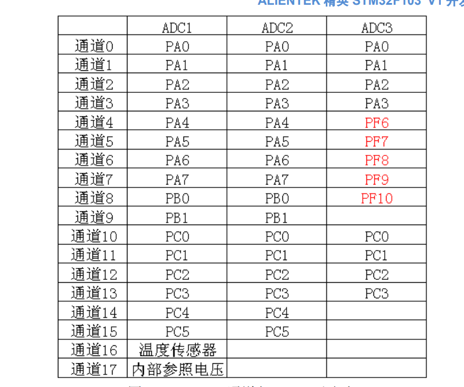
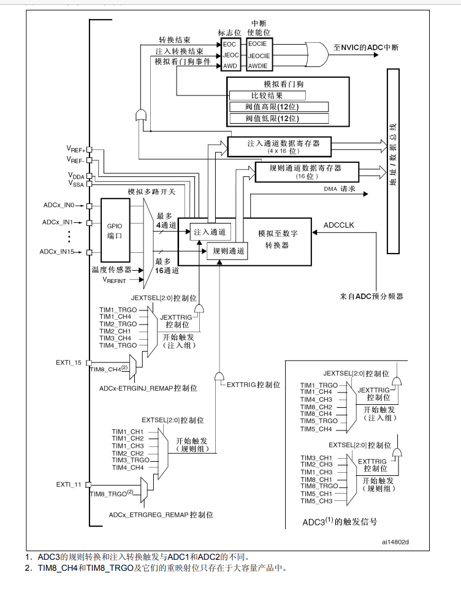

#                    ADC

## ADC介绍

12位ADC是一种逐次逼近型模拟数字转换器。它有多达18个通道，可测量16个外部和2个内部 信号源。各通道的A/D转换可以单次、连续、扫描或间断模式执行。ADC的结果可以左对齐或右 对齐方式存储在16位数据寄存器中。 模拟看门狗特性允许应用程序检测输入电压是否超出用户定义的高/低阀值。 ADC的输入时钟不得超过14MHz，它是由PCLK2经分频产生。


```
 #include "adc.h"
 #include "delay.h"
	   
//初始化ADC
//这里我们仅以规则通道为例
//我们默认将开启通道0~3																	   
void  Adc_Init(void)
{ 	
	ADC_InitTypeDef ADC_InitStructure; 
	GPIO_InitTypeDef GPIO_InitStructure;

	RCC_APB2PeriphClockCmd(RCC_APB2Periph_GPIOA |RCC_APB2Periph_ADC1	, ENABLE );	  //使能ADC1通道时钟
 

	RCC_ADCCLKConfig(RCC_PCLK2_Div6);   //设置ADC分频因子6 72M/6=12,ADC最大时间不能超过14M

	//PA1 作为模拟通道输入引脚                         
	GPIO_InitStructure.GPIO_Pin = GPIO_Pin_1;
	GPIO_InitStructure.GPIO_Mode = GPIO_Mode_AIN;		//模拟输入引脚
	GPIO_Init(GPIOA, &GPIO_InitStructure);	

	ADC_DeInit(ADC1);  //复位ADC1,将外设 ADC1 的全部寄存器重设为缺省值

	ADC_InitStructure.ADC_Mode = ADC_Mode_Independent;	//ADC工作模式:ADC1和ADC2工作在独立模式
	ADC_InitStructure.ADC_ScanConvMode = DISABLE;	//模数转换工作在单通道模式
	ADC_InitStructure.ADC_ContinuousConvMode = DISABLE;	//模数转换工作在单次转换模式
	ADC_InitStructure.ADC_ExternalTrigConv = ADC_ExternalTrigConv_None;	//转换由软件而不是外部触发启动
	ADC_InitStructure.ADC_DataAlign = ADC_DataAlign_Right;	//ADC数据右对齐
	ADC_InitStructure.ADC_NbrOfChannel = 1;	//顺序进行规则转换的ADC通道的数目
	ADC_Init(ADC1, &ADC_InitStructure);	//根据ADC_InitStruct中指定的参数初始化外设ADCx的寄存器   

  
	ADC_Cmd(ADC1, ENABLE);	//使能指定的ADC1
	
	ADC_ResetCalibration(ADC1);	//使能复位校准  
	 
	while(ADC_GetResetCalibrationStatus(ADC1));	//等待复位校准结束
	
	ADC_StartCalibration(ADC1);	 //开启AD校准
 
	while(ADC_GetCalibrationStatus(ADC1));	 //等待校准结束
 
//	ADC_SoftwareStartConvCmd(ADC1, ENABLE);		//使能指定的ADC1的软件转换启动功能

}				  
//获得ADC值
//ch:通道值 0~3
u16 Get_Adc(u8 ch)   
{
  	//设置指定ADC的规则组通道，一个序列，采样时间
	ADC_RegularChannelConfig(ADC1, ch, 1, ADC_SampleTime_239Cycles5 );	//ADC1,ADC通道,采样时间为239.5周期	  			    
  
	ADC_SoftwareStartConvCmd(ADC1, ENABLE);		//使能指定的ADC1的软件转换启动功能	
	 
	while(!ADC_GetFlagStatus(ADC1, ADC_FLAG_EOC ));//等待转换结束

	return ADC_GetConversionValue(ADC1);	//返回最近一次ADC1规则组的转换结果
}

u16 Get_Adc_Average(u8 ch,u8 times)
{
	u32 temp_val=0;
	u8 t;
	for(t=0;t<times;t++)
	{
		temp_val+=Get_Adc(ch);
		delay_ms(5);
	}
	return temp_val/times;
} 	 

```






